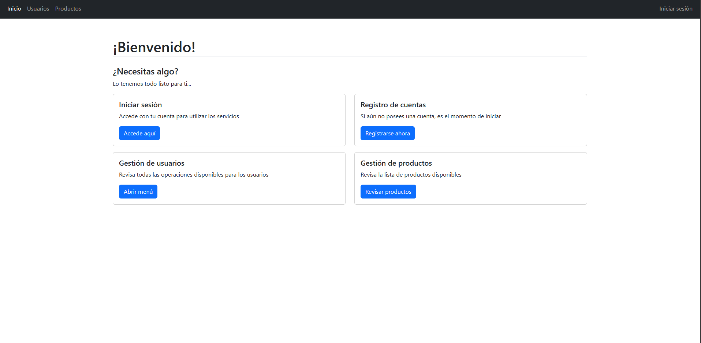
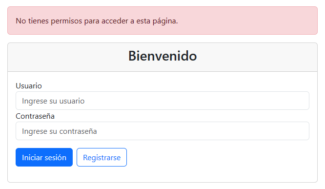
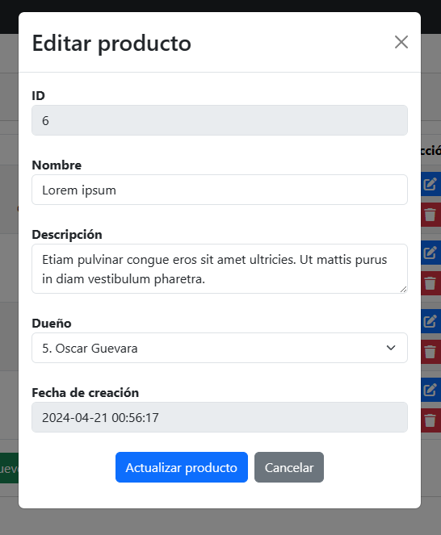

<!-- Header -->

    
	<h1 align="center">PDO CRUD - MVC</h1>
	
 Proyecto con fines educativos y de aprendizaje autodidacta 

 

<table align="center">
    <thead>
        <tr>
            <th colspan="2">
Características
</th>
        </tr>
    </thead>
    <tbody>
        <tr>
            <td>
                <h3>Página de inicio y sistema de navegación</h3>
                
Diseños hechos con Bootrap5 bajo la arquitectura MVC

            </td>
            <td>
                
            </td>
        </tr>
        <tr>
            <td>
                <h3>Manejo de sesiones</h3>
                
Incluyen validaciones de sesión, formularios de inicio de sesión y registro de cuentas que permiten ejecutar diversas acciones

            </td>
            <td>
                
            </td>
        </tr>
        <tr>
            <td>
                <h3>Gestión de usuarios</h3>
                
Permite administrar los usuarios existentes en el sistema, modificar credenciales y eliminarlos de manera sencilla

            </td>
            <td>
                
            </td>
        </tr>
        <tr>
            <td>
                <h3>Inventario de productos</h3>
                
Los usuarios pueden poseer productos los cuales pueden ser inspeccionados en su propio apartado, pueden ser agregados, modificados y eliminados

            </td>
            <td>
                
            </td>
        </tr>
    <tbody>
</table>